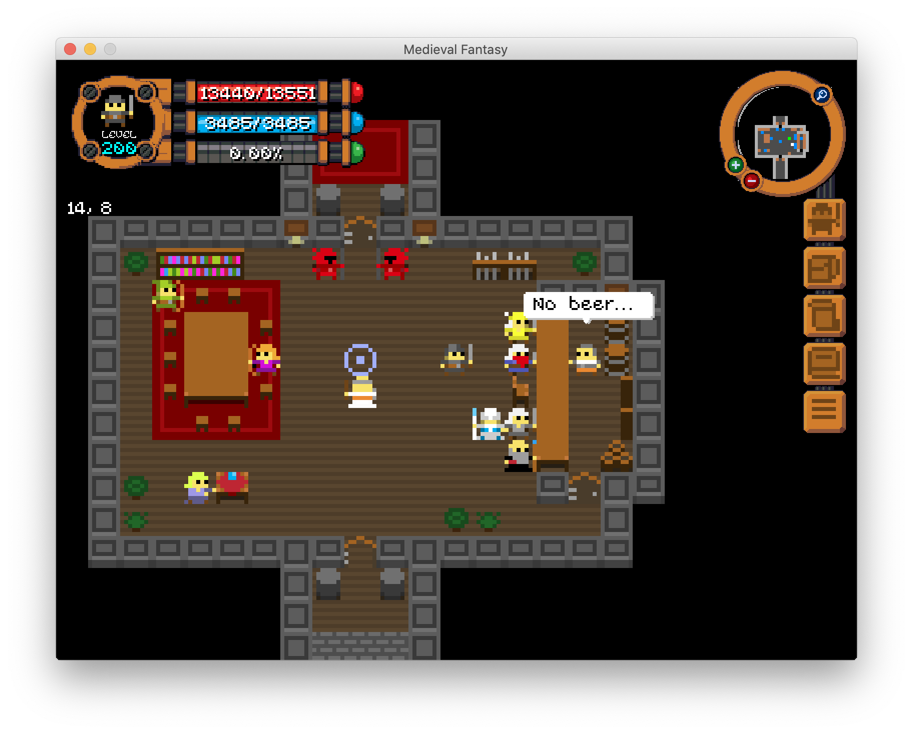
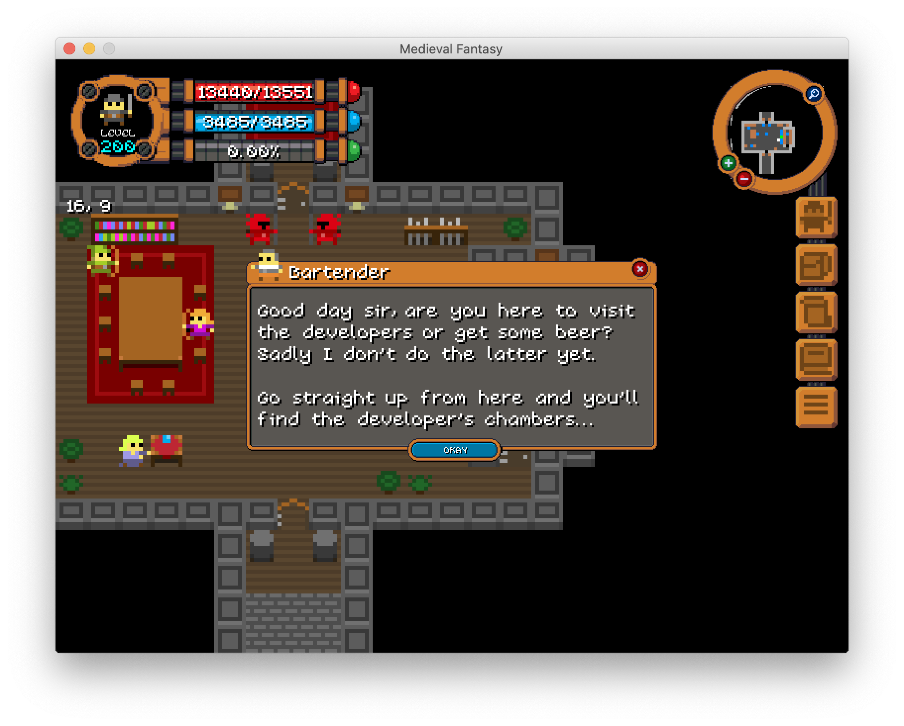
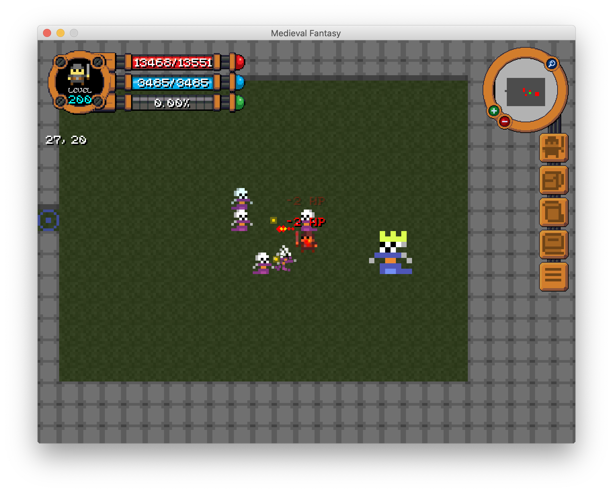

Medieval-Fantasy
================
Original description (2014): A Slick2D game written to test the authors' knowledge of 2D game design. The theme is medieval fantasy. A game title has not been decided.

Remark: The first collaborative project with HiddenGhost14. The tile set was made by Oryx, who is also the original artist behind Realm of the Mad God. The game was made in Java Slick2D, featuring a simple grid-locked combat system, dynamic NPC scripting engine and comprehensive game UI.

Total time spent: approximately 1 month and 15 days. Original date: December 2014 to mid January 2015.   

